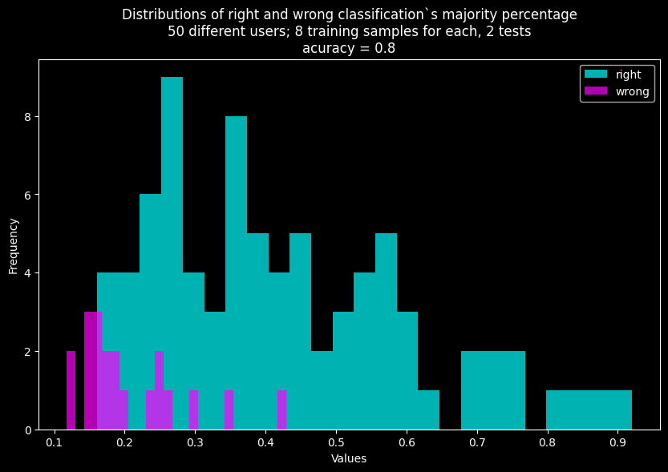

# Linear Algebra course project: Speaker Recognition

Authors:
Ustym Hentosh, Lev Kupybida, Volodymyr Bronetskyi

## Introductiuon
This ropository contains code that implements and tests speaker recognition system based on **Mel-Frequency Cepstral Coefficients** as feature extraction step and **K-neares-neighbours** as classification algorithm.

## Сontent
### src
- **classifier.py** - provide classificator class for training and testing
- **launch.py** - runs the system
- **mfcc.py** - code for extracting mfcc
- **moses.py** - code for spliting dataset
- **plotter.ipynb** - code for plotting graphs

### results
- **validation_1/ & validation_2/** - data and results of validation step
- **testing/** - results of testing
- **comparison/** - results of comparing two mfcc methods from librosa and our own

### app
- contains code for a simple desktop application for classification your own data

## Data
Big shoutout to Mozila Common Voice community for providing big dataset with voice recordings - https://commonvoice.mozilla.org/uk/datasets

## Results
Our results while testing classification with 50 users male and female with 8 samples of training data and 2 of testing for each is accuracy of **0.8%**

